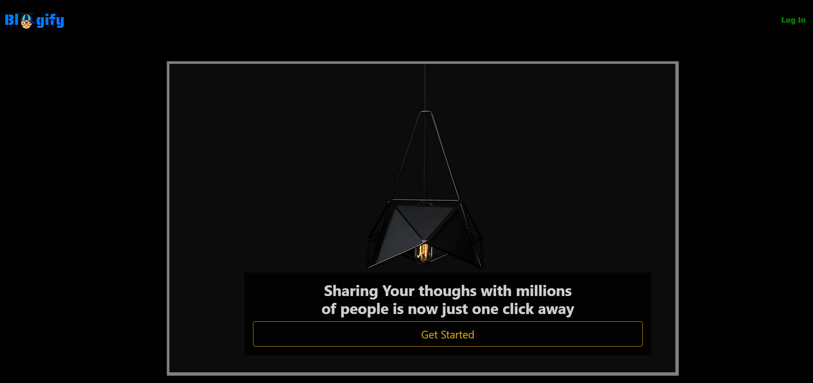
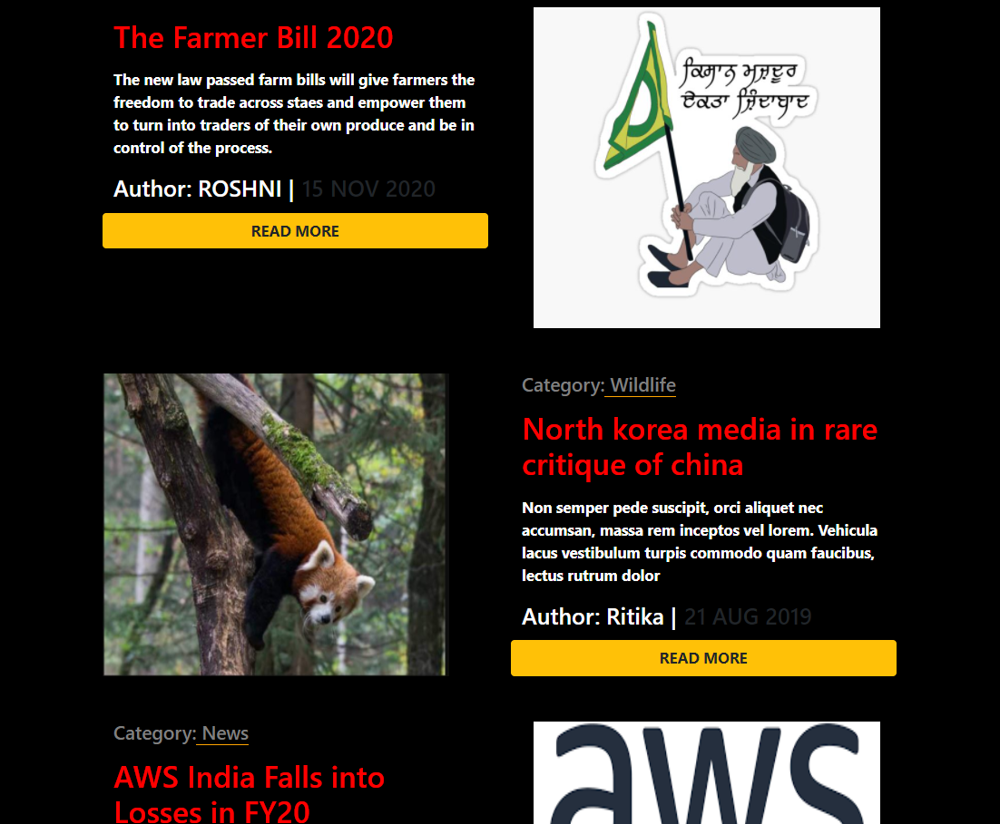
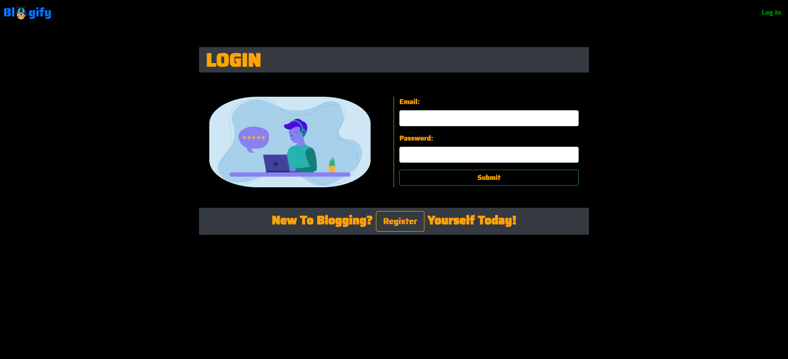
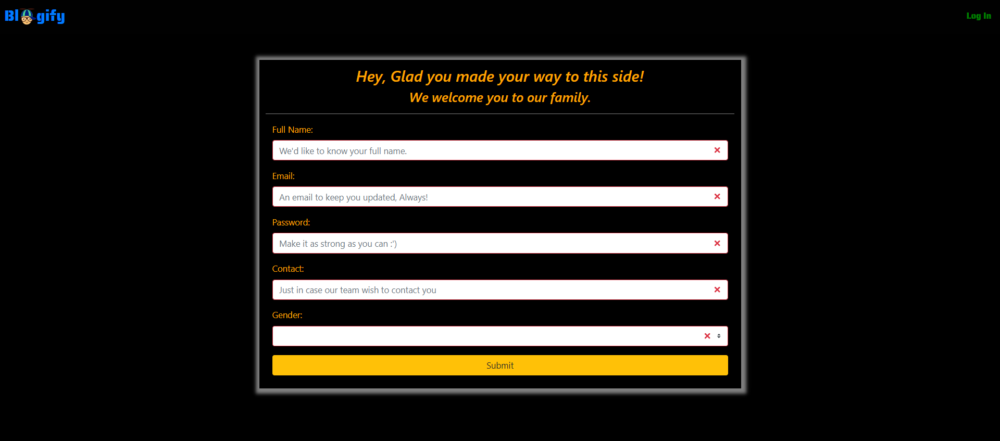
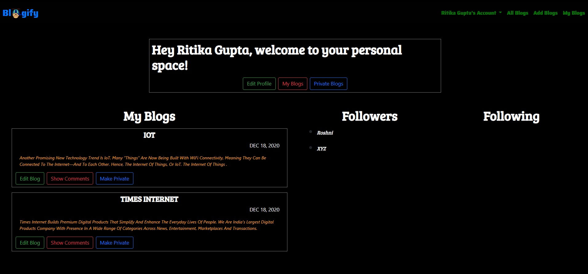
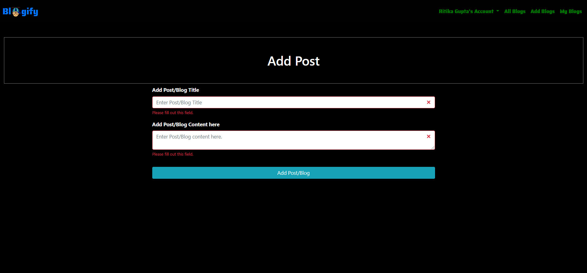
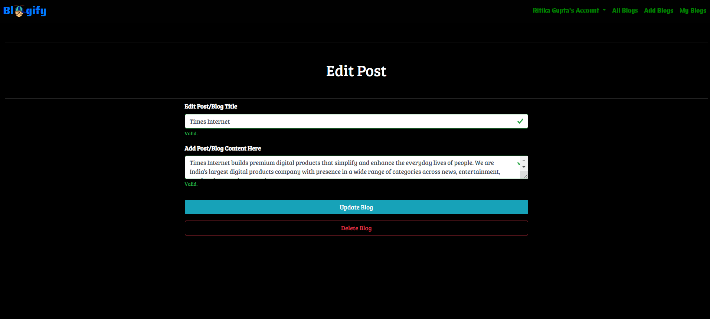
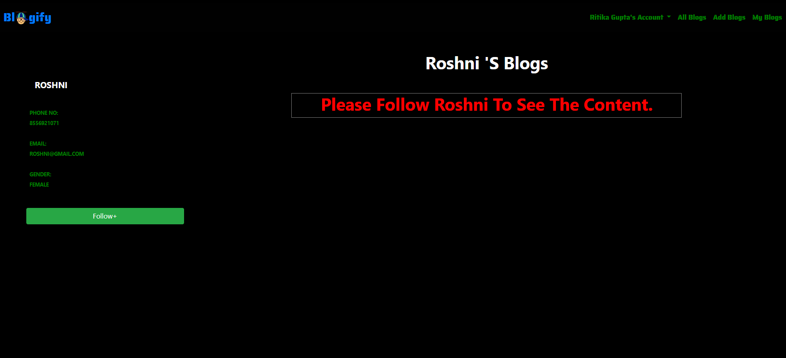
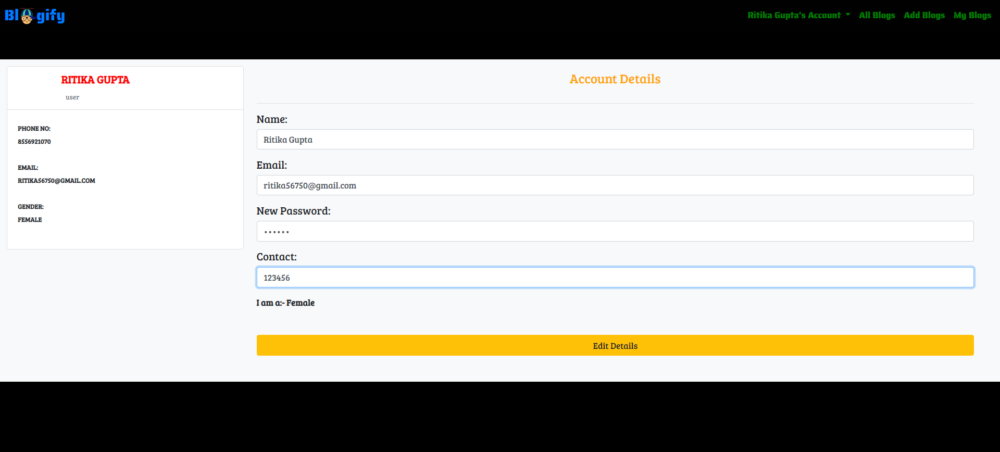

# BlogApplication
## General info
full stack blogging application using angular and spring framework
In this bloggers can create blog,edit,comment on blog,update blogs and follow,unfollow other bloggers to see blog posts.

## Technologies
Project is created with:
* Frontend-Angular
* Backend-SpringBoot
* Database-Mysql
	
## Setup
To run this project, install IntellijCommunity or enterprise
```
$ cd to frontend and backend 
$ run the project
```
## Features:
* Login-Signup
* Add,Update,Delete,Comment on Blog
* Follow-Unfollow Bloggers
* Public,Privte Blogs
* Edit,View Blogger Profile

# BLOGIFY




## LOGIN PAGE


## SIGNUP PAGE


## BLOG POST , FOLLOWERS AND FOLLOWING LIST


## ADD BLOG


## EDIT BLOG


## OTHER BLOGGERS POST


## VIEW,EDIT PROFILE



